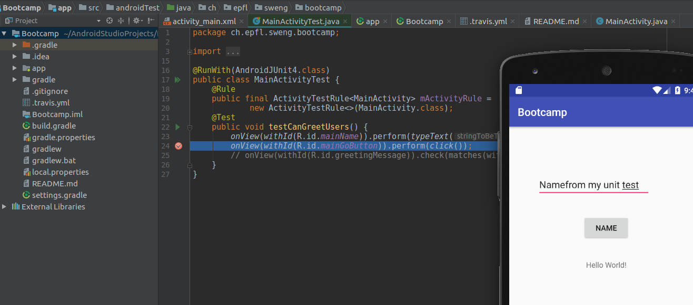
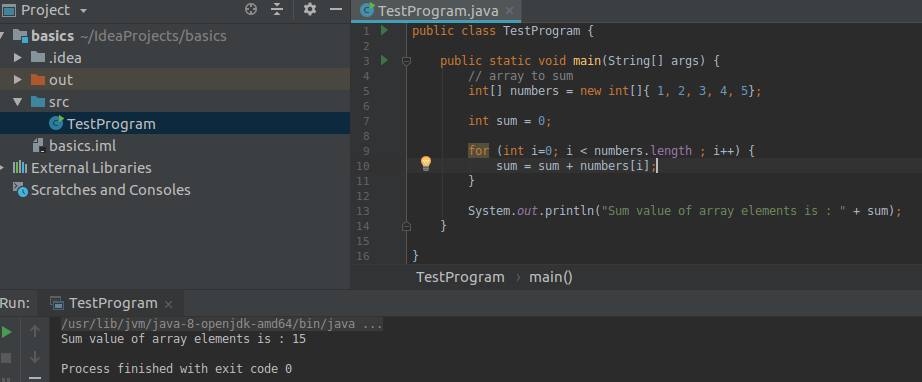
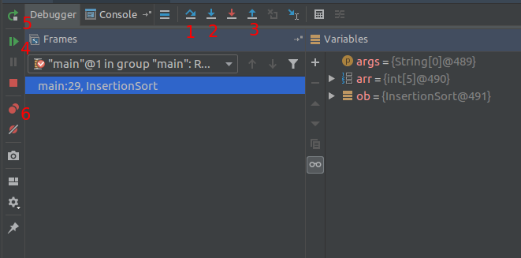
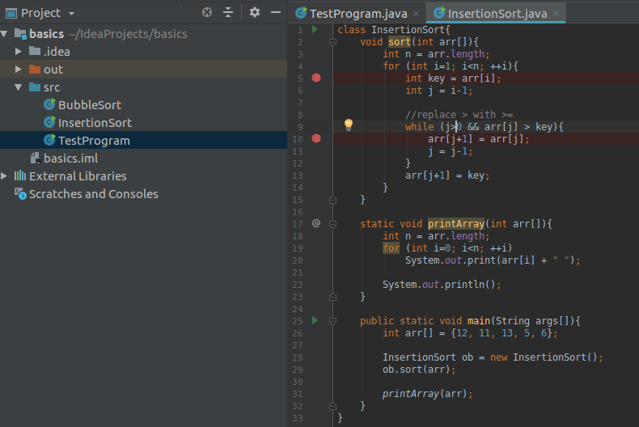
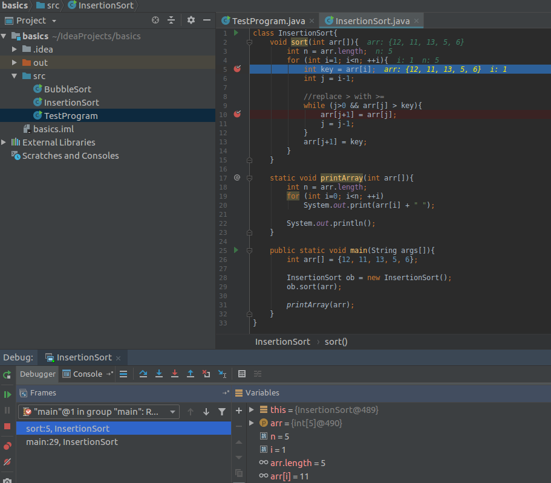
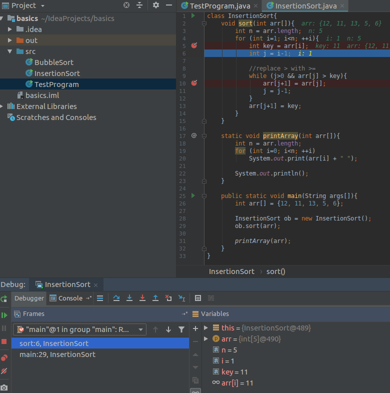
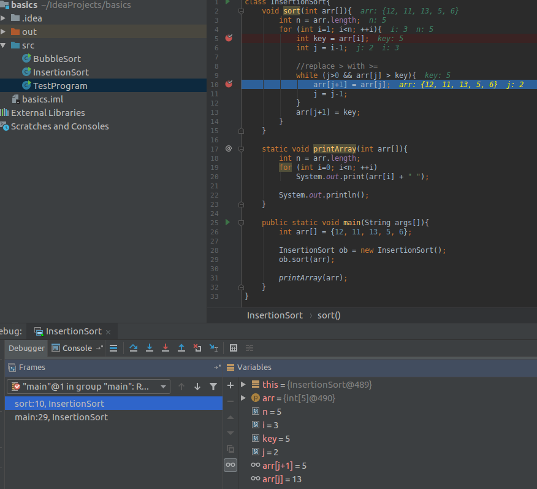
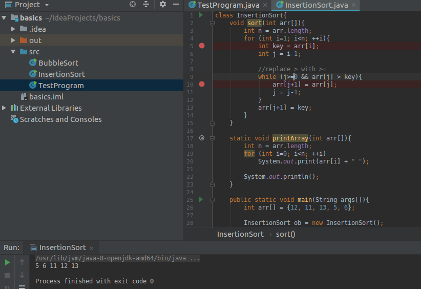

# Exercise 4: Compiling and Debugging in the IDE
In this exercise, we will use the IntelliJ IDE to apply what we have learned in [ex2](../../ex2/README.md).

For Java and Android development, developers are inclined to use IDEs. The reason is that IDEs come with a lot of components that help you to develop code easily such as syntax highlighting, code completion, compilation support, etc.

While IDEs are extremely useful, bear in mind that in this course, the command line provides the "ultimate truth", so you *must* be familiar with it as well. After all, an IDE is usually just executing these commands behind the scenes. 

#### Important
For the SDP course, we recommend using Android Studio IDE. For this exercise, to focus on the debugging aspect of the IDE, we use IntelliJ as it is more straightforward to navigate and use. Android Studio is a fork of IntelliJ IDE, thus most of the functionalities that are available in IntelliJ are also available in Android Studio. Therefore, whatever you can do for debugging in IntelliJ, you will also be able to do the same things in Android Studio. 

Figure below shows debugging in Android Studio, which is almost exactly the same as debugging in IntelliJ.



## Prerequisites
* Make sure you have gotten familiar with command line compilation and debugging ([ex2](../../ex2/README.md)).
* Download and install [IntelliJ](https://www.jetbrains.com/idea/), the Java IDE from JetBrains.

## Exercise 4.1: Compiling and Running

1. Open IntelliJ, create a new project, choose the default options (make sure Java SDK is properly selected).
2. Right-click to the *src* directory, *New*, *Java Class*, then give the class name `TestProgram`.
3. Copy the program below.

```java
public class TestProgram {
  
  public static void main(String[] args) {
    // array to sum
    int[] numbers = new int[]{ 1, 2, 3, 4, 5};

    int sum = 0;

    for (int i=0; i < numbers.length ; i++) {
      sum = sum + numbers[i];
    }

    System.out.println("Sum value of array elements is : " + sum);
  }

}
```

4. Right-click to the `TestProgram` file and select *Run TestProgram.main()* which will compile and run the program for you. You can run any class that has a main method this way.



## Exercise 4.2: The Debugger

1. Create a new Java Class named `InsertionSort`.
2. Copy the following code into it.
```java
class InsertionSort{
    void sort(int arr[]){
        int n = arr.length;
        for (int i=1; i<n; ++i){
            int key = arr[i];
            int j = i-1;
 
            //replace > with >=
            while (j>0 && arr[j] > key){
                arr[j+1] = arr[j];
                j = j-1;
            }
            arr[j+1] = key;
        }
    }

    static void printArray(int arr[]){
        int n = arr.length;
        for (int i=0; i<n; ++i)
            System.out.print(arr[i] + " ");

        System.out.println();
    }

    public static void main(String args[]){
        int arr[] = {12, 11, 13, 5, 6};

        InsertionSort ob = new InsertionSort();
        ob.sort(arr);

        printArray(arr);
    }
}
```

3. Run the code. As you can see, this code is not working properly. Let's use debugging to solve it.

### Debugging
Let's first examine the code, there are three methods (main, printArray, sort). *main* creates the InsertionSort object and then passes the array to the *sort* function of the object. So, there is nothing interesting here. *printArray* iterates over the array and prints it out to the commandline. Nothing interesting here too. Let's focus on the *sort* method.

Since we are working on the [insertion sort algorithm](https://en.wikipedia.org/wiki/Insertion_sort), let's remember the few ideas we need to ensure in the program. The algorithm starts with a sorted list and then grows this list an element at a time while maintaining that the new list created by adding the element is sorted. In other words, there are two loops. The outer one adds a single element to the sorted array at each iteration by just iterating over the original array. The inner array is used to put the newly added element to the correct location in the sorted array and shift the remaining elements accordingly if there are any.

#### Breakpoints, Step-Into, Step Over
Let's examine the inner and outer loops and how it modifies the array. We suspect the bug is somehow related.
First let's learn what we can do with debugging.

The figures below are the interface that you will use.




### Most useful commands to know
0. Breakpoints: Code line locations to pause the execution of the program. The developer can execute expressions and view the state of the program.
1. Step-Over: Execute the method call and skip to the next statement without getting into inner details of the method.
2. Step-Into: Execute a statement, if it is a method call, go inside the method.
3. Step-Out: Finish the method call, return from it to the caller method and go to the next statement.
4. Resume: Resume until the next breakpoint, if no breakpoint then continue until the end of the program execution.
5. Re-run: Restart the debugged program.
5. View breakpoints: You can observe and modify all breakpoints.

The general flow of debugging usually starts by putting breakpoints at certain locations to get information about the state of the variables. Then, more information is accumulated by using step-into and step-over. Sometimes, stepping within a method becomes tedious, you quickly jump back to the caller function by using step-out. When you want to continue to the next breakpoint without doing any steps, you use resume. If you did not derive enough information there is always re-run to help you start again from scratch once you modify your breakpoints. If you want more control over your breakpoints, use view breakpoints. 

* For more information, visit IntelliJ debugger [IntelliJ debugger](https://www.jetbrains.com/help/idea/debugging-code.html).

### Debugging the program

Instructions to follow
1. Put breakpoints to line 5, 10. Press the empty space right after the line number. It will put a red point. 



2. Right-click to the `InsertionSort` file and select *Debug InsertionSort.main()* which will compile and run the debugger for you.
3. Examine the values in the array. Look at the variables. 



4. Press *Step-Into* to skip a statement.



5. Press *Step-Into* one more time.
6. Press, *Step-Into* to debug inside the while loop. But wait, you can't get into the while loop, because it is evaluated to false. Do one more round in for loop. 



7. Observe that, in the inner loop, the first element is not touched, which is wrong. Fix the comparison operator.
8. Run `InsertionSort`. Now your program should work! 



* Key take away: If you can run an application, you can also debug it!


